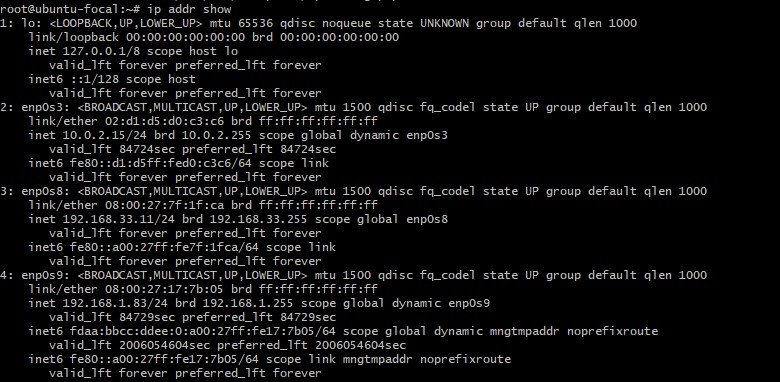
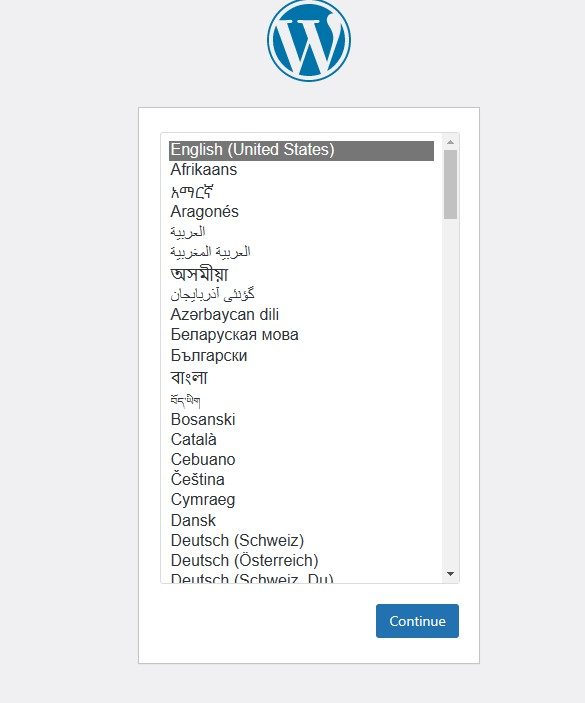
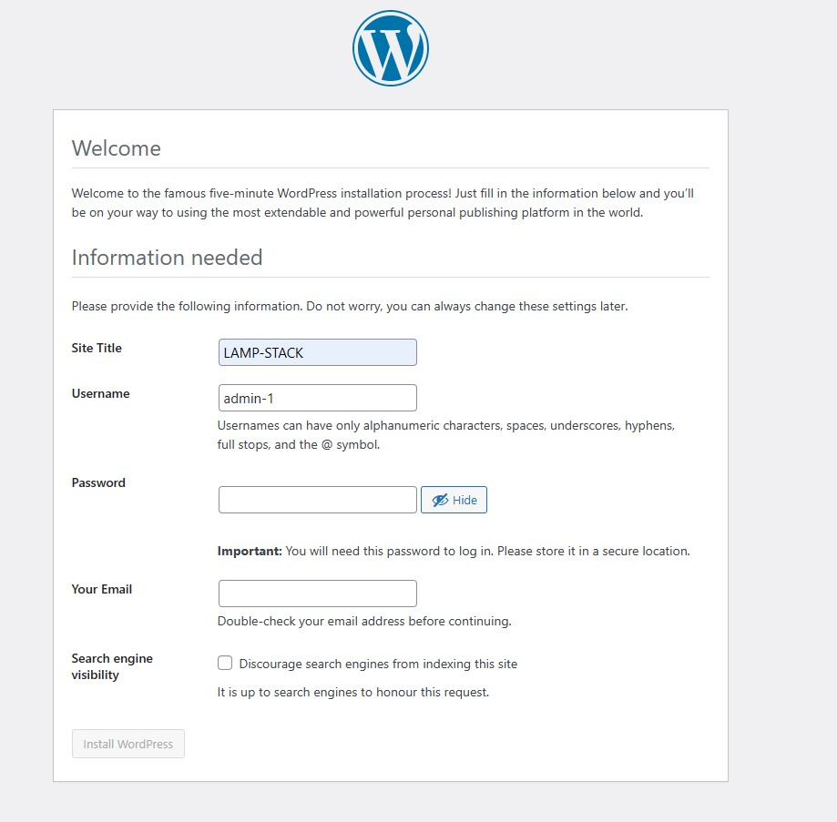
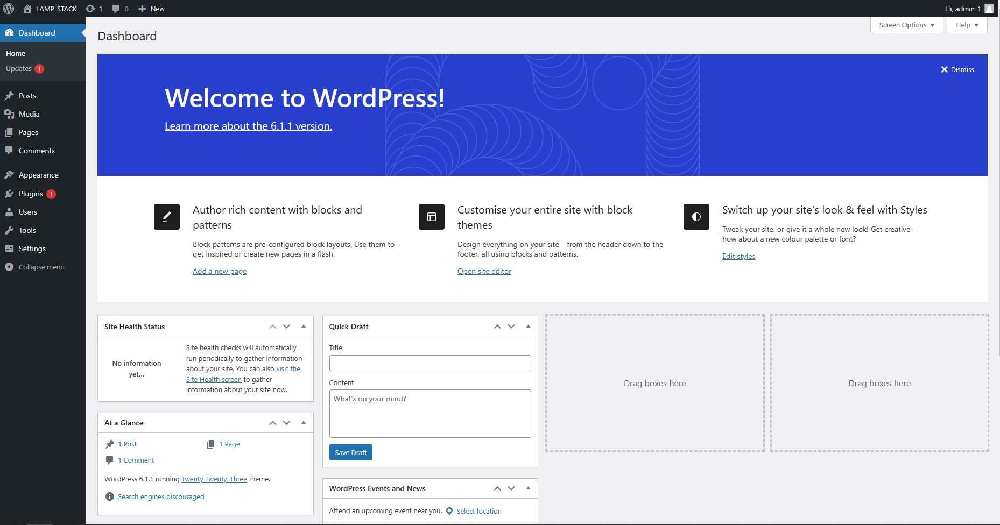

# LAMPSTACK Wordpress Configuration on Ubuntu server using Vagrant

In this project we will be using vagrant to lunch ubuntu server automatically and then setup a website with wordpress. Follow the steps below:

1   Create a directory where your work will be saved:

`mkdir -p /<directory to save the new directory>/wordpress`

Note: the directory in which you want to save your parent directory for wordpress could be deskotp, download, local disk or any directory of your choice.

2 `cd` into the wordpress directory you have created and then bring up your virtual machine.

3 Initialize vagrant

`vagrant init <ubuntu configuration>`

Note: you use any ubuntu configuration you like. Get an ubuntu configuration from vagrant cloud website 
[vagrant cloud](https://app.vagrantup.com/boxes/search?utf8=%E2%9C%93&sort=downloads&provider=&q=ubuntu+20.04)


4 Open the vagrantfile and edit the configuration inside.
  
  `vim Vagrantfile`

Note: watch the video in the link attached to the bottom of this page to know the exact changes you need to make.

5 Activate virtual machine

`vagrant up`

6 Login to the ubuntu

`vagrant ssh`

7 switch to root user and then update and upgrade the server

1. `sudo -i`

2. `apt update`

3. `apt upgrade -y`


8 Install and configure wordpress by following the steps below:

1. Install all dependencies

`apt install apache2 \
                 ghostscript \
                 libapache2-mod-php \
                 mysql-server \
                 php \
                 php-bcmath \
                 php-curl \
                 php-imagick \
                 php-intl \
                 php-json \
                 php-mbstring \
                 php-mysql \
                 php-xml \
                 php-zip -y`

2. Create installation directory for wordpress

`sudo mkdir -p /srv/www`

`sudo chown www-data: /srv/www`

`curl https://wordpress.org/latest.tar.gz | sudo -u www-data tar zx -C /srv/www`

3. Create apache site
`vim /etc/apache2/sites-available/wordpress.conf`

paste the code below into the file
```
<VirtualHost *:80>
    DocumentRoot /srv/www/wordpress
    <Directory /srv/www/wordpress>
        Options FollowSymLinks
        AllowOverride Limit Options FileInfo
        DirectoryIndex index.php
        Require all granted
    </Directory>
    <Directory /srv/www/wordpress/wp-content>
        Options FollowSymLinks
        Require all granted
    </Directory>
</VirtualHost>
```
4. Enable the site

`sudo a2ensite wordpress`

5. Enable URL write

`sudo a2enmod rewrite`

6. Disable the default site

`sudo a2dissite 000-default`

7. Reload apache2 to effect changes made

`sudo service apache2 reload`

8. Configure Database

  - `sudo mysql -u root`
- `CREATE DATABASE wordpress;`
- `CREATE USER wordpress@localhost IDENTIFIED BY '<your-password>';`
- `GRANT SELECT,INSERT,UPDATE,DELETE,CREATE,DROP,ALTER`
   
   `ON wordpress.*`

   `TO wordpress@localhost;`

- `FLUSH PRIVILEGES;`

- `quit`

9. Enable MySQL 

`sudo service mysql start`

10. Configure WordPress to connect to the database

- `sudo -u www-data cp /srv/www/wordpress/wp-config-sample.php /srv/www/wordpress/wp-config.php`

- `sudo -u www-data sed -i 's/database_name_here/wordpress/' /srv/www/wordpress/wp-config.php`

- `sudo -u www-data sed -i 's/username_here/wordpress/' /srv/www/wordpress/wp-config.php`

- `sudo -u www-data sed -i 's/password_here/<your-password>/' /srv/www/wordpress/wp-config.php`

11. open the configuration file

`vim /srv/www/wordpress/wp-config.php`

look for the content below in the file and delete them

```
define( 'AUTH_KEY',         'put your unique phrase here' );
define( 'SECURE_AUTH_KEY',  'put your unique phrase here' );
define( 'LOGGED_IN_KEY',    'put your unique phrase here' );
define( 'NONCE_KEY',        'put your unique phrase here' );
define( 'AUTH_SALT',        'put your unique phrase here' );
define( 'SECURE_AUTH_SALT', 'put your unique phrase here' );
define( 'LOGGED_IN_SALT',   'put your unique phrase here' );
define( 'NONCE_SALT',       'put your unique phrase here' );
```

and replace with the content below:

```
define('AUTH_KEY',         'aV|Z(1+e37?FRjMoWd5K*W7RuKL(G<Nf%bVBA-5.Iq-4#DIf}`sORr-MZ[cA7E7X');
define('SECURE_AUTH_KEY',  '7`@E$;nn)DOmWw4%1Vq${mE zdcG+p4Y_DCbh/mBzAZ.|LmFqW3M&?V/-rVA[k_M');
define('LOGGED_IN_KEY',    '!A1wx0O>2--Zc]_8dvBP$6+@,- #q8qQSay$0$Big!+Y~+5J#+$MC^C`j7Ys<84R');
define('NONCE_KEY',        '9XVvyS4Iu4A -xG<2*>Wg$pn/!4Usnvt~X[3]kmXTfRPr<DPUpV6|E(~>0_3h;ea');
define('AUTH_SALT',        'smyOistt56pV1.o;xA^;if0pi[M##vZH3iWb?[Casy2e9}?nv,f4[cL 6ga9Sf-e');
define('SECURE_AUTH_SALT', ',|};)g(, 4E Ca1su<.wO|/T6++TR&y6.qEsDF#!|l3O/TuOQz1</ySoDVcK}`%:');
define('LOGGED_IN_SALT',   'V SvJ1BSt/$Xz {tNw:Ef^qsnRFccQIdmT+A!zX~1v6G;1$pLqHR5n@z.hZ&L:kL');
define('NONCE_SALT',       'cK{7CAme}-?]d+^VqFk8bx(S%m8=S<-YZ[/j|Oy!jjuzfWdB]9|jkcH+JI0hBb`W');
```

12. Configure WordPress

    To configure the wordpress we need to get access to the website with ip address.
    
    To get the ip run:

    `sudo ip addr show`

    

If you get the images below, it means your configuration is working very fine and you can go ahead to input require fields







Hurray!!! your wordpress website is ready and you can go ahead to make adjustment the way you like.




For full explanation of how this is done, watch the video in the link below:

[LAMP-STACK-IMPLEMENTATION](https://youtu.be/ljD1PvIiaQA)